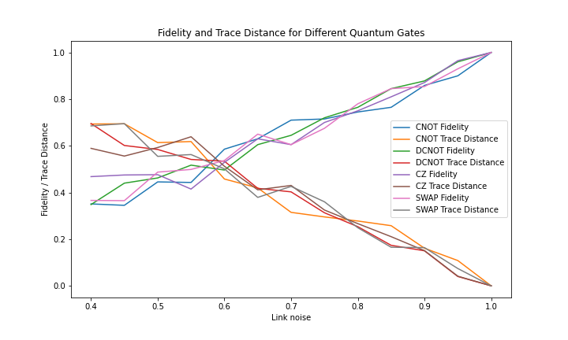
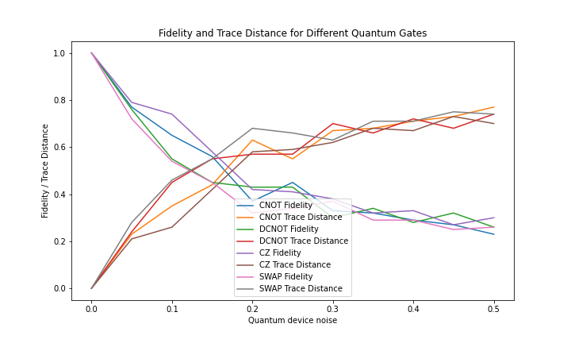

# SquidKnit: Circuit knitting with quantum and classical communication using SquidASM

#### Valter Uotila, PhD student, University of Helsinki

__Overview__: Scaling up a qubit number and the connectivity between the qubits is a considerable challenge for quantum hardware developers. Recent research has proposed circuit knitting as a solution. Circuit knitting is the procedure of breaking down a quantum circuit into sub-circuits, running these sub-circuits on one or more quantum processors, and integrating the outcomes to reconstruct the original circuit's result. In this work, I study one circuit knitting scheme for Clifford gates. In this work, circuit knitting means a teleportation scheme that teleports two states through a Clifford gate and automatically applies the needed correction operation. In the future, circuit knitting could be performed across distributed quantum computers connected to the quantum internet.

## Introduction to problem

Initially, my interest in this topic was sparked by the [blog post](https://research.ibm.com/blog/100k-qubit-supercomputer) and [blog post](https://research.ibm.com/blog/circuit-knitting-with-classical-communication) by IBM. They aim to build a 100,000 qubits quantum-centric supercomputer. The main idea is to connect multiple smaller quantum computers with classical and quantum links.

The blog post refers to the paper [Circuit knitting with classical communication](http://arxiv.org/abs/2205.00016), which has worked as a starting point for this implementation. The paper contains the following figure describing one possible circuit knitting scheme for Clifford gates.

We require that the gate $U$ is Clifford since, otherwise, the correction operation is not local (does it even exist for non-Clifford gates?). 

One way to understand the construction is to rewrite the circuit using [string diagrams](https://doi.org/10.1017/9781316219317):

For example, for CNOT-gate the previous construstion becomes [this](https://algassert.com/quirk#circuit=%7B%22cols%22:[[%22%E2%80%A6%22,%22%E2%80%A6%22,%22%E2%80%A6%22,%22%E2%80%A6%22,%22%E2%80%A6%22,%22%E2%80%A6%22],[1,%22H%22,1,%22H%22],[1,%22%E2%80%A2%22,%22X%22],[1,1,1,%22%E2%80%A2%22,%22X%22],[1,1,%22X%22,%22%E2%80%A2%22],[%22%E2%80%A2%22,%22X%22],[%22H%22],[%22Measure%22,%22Measure%22],[1,1,1,1,%22%E2%80%A2%22,%22X%22],[1,1,1,1,%22H%22],[1,1,1,1,%22Measure%22,%22Measure%22],[%22%E2%80%A2%22,1,%22Z%22,%22Z%22],[1,1,%22X%22,%22X%22,1,%22%E2%80%A2%22],[1,1,1,%22Z%22,%22%E2%80%A2%22],[1,%22%E2%80%A2%22,%22X%22]]%7D) and for CZ-gate it becomes [this](https://algassert.com/quirk#circuit=%7B%22cols%22:[[%22X%22,1,1,1,1,%22X%22],[%22%E2%80%A6%22,%22%E2%80%A6%22,%22%E2%80%A6%22,%22%E2%80%A6%22,%22%E2%80%A6%22,%22%E2%80%A6%22],[1,%22H%22,1,%22H%22],[1,1,1,%22%E2%80%A2%22,%22X%22],[1,%22%E2%80%A2%22,%22X%22],[1,1,%22Z%22,%22%E2%80%A2%22],[%22%E2%80%A2%22,%22X%22],[%22H%22],[%22Measure%22,%22Measure%22],[1,1,1,1,%22%E2%80%A2%22,%22X%22],[1,1,1,1,%22H%22],[1,1,1,1,%22Measure%22,%22Measure%22],[1,1,%22Z%22,%22X%22,1,%22%E2%80%A2%22],[1,1,1,%22Z%22,%22%E2%80%A2%22],[1,%22%E2%80%A2%22,%22X%22,%22Z%22],[1,%22%E2%80%A2%22,%22Z%22]]%7D).

A similar idea is also presented [here](https://algassert.com/post/1717) and [here](https://en.wikipedia.org/wiki/Quantum_gate_teleportation).

## Implementation

First, I aimed to implement the version presented in the paper [Circuit knitting with classical communication](http://arxiv.org/abs/2205.00016). However, I did not know how to prepare the Choi state in practice. To work around this, the same circuit also has a simple cut into three parts:

Now, we see that interaction between the parts can be realized with two EPR pairs and classical communication. This leads to three nodes and two links. You can find an initial draft in the folder `application_three_nodes`. I should have tried to use the SquidASM beta version to run this multi-node simulation, but I noticed the beta version at the very end of the challenge.

The second way to organize the circuit is the following:

In practice, this method is just two-state teleportations that teleport the state through the two-qubit gate. The first four qubits are on the client side and provide input for the gate U. The last two are on the server side. This scheme might be useful, for example, when the state is on a machine that does not implement the two-qubit gate. The same method for CNOT-gate is proposed in the paper [Quantum Teleportation is a Universal Computational Primitive](https://arxiv.org/abs/quant-ph/9908010) (Figure 2).

### Correction operator

After one is familiar with teleportation, it is easy to see that my method applies teleportation twice. Single-state quantum teleportation involves a correction operator, and similarly, we need to use a correction operator after this teleportation. Then, what is the correction operator, and how do you construct it for any Clifford gate?

The answer is provided in papers [Quantum Teleportation is a Universal Computational Primitive](https://arxiv.org/abs/quant-ph/9908010v1) and [A Theory of Fault-Tolerant Quantum Computation](https://arxiv.org/abs/quant-ph/9702029v2). The idea is to check how the Clifford gate acts on the Pauli group. This is performed by calculating $U(I \otimes X)U^{\dagger}$, $U(I \otimes Z)U^{\dagger}$, $U(Z \otimes I)U^{\dagger}$ and $U(X \otimes I)U^{\dagger}$. We then construct the Pauli decomposition for each of the outcomes. These Pauli decompositions provide the correction operator. I implemented this with Pennylane, and the code is in `utils.py`.

## Discussion

To demonstrate that the framework produces reasonable results, I have tested the model with SquidASM using the noise models for links and qdevices. The code for this can be found in `experiments.py`. The results are the following:

There is some related work on circuit knitting. Qiskit implements the [circuit knitting toolbox](https://qiskit-extensions.github.io/circuit-knitting-toolbox/). ZX-calculus-based circuit knitting presentation can be found on [YouTube](https://www.youtube.com/watch?v=YPtEIuapWww) and the corresponding paper [Cutting multi-control quantum gates with ZX calculus](https://arxiv.org/abs/2302.00387). Other relevant papers are [Simulating Large Quantum Circuits on a Small Quantum Computer](https://arxiv.org/abs/1904.00102), [Constructing a virtual two-qubit gate by sampling single-qubit operations](https://iopscience.iop.org/article/10.1088/1367-2630/abd7bc/meta), [Fast quantum circuit cutting with randomized measurements
](https://arxiv.org/abs/2207.14734), [Optimal wire cutting with classical communication](https://arxiv.org/abs/2302.03366), and [Optimal parallel wire cutting without ancilla qubits
](https://arxiv.org/abs/2303.07340).

I have no experience in quantum networks, circuit knitting, or SquidASM, so this small project was a nice introduction to the topic. My main research topic is to study how quantum computing could be applied to databases and database optimization. Some of my contributions can be found on my personal website [valteruo.github.io](https://valteruo.github.io/). Since databases also utilize various networks, I would like to know if these two topics have an interesting connection. Also, circuit knitting is a relatively researched topic, and many other algorithms could be implemented with SquidASM.