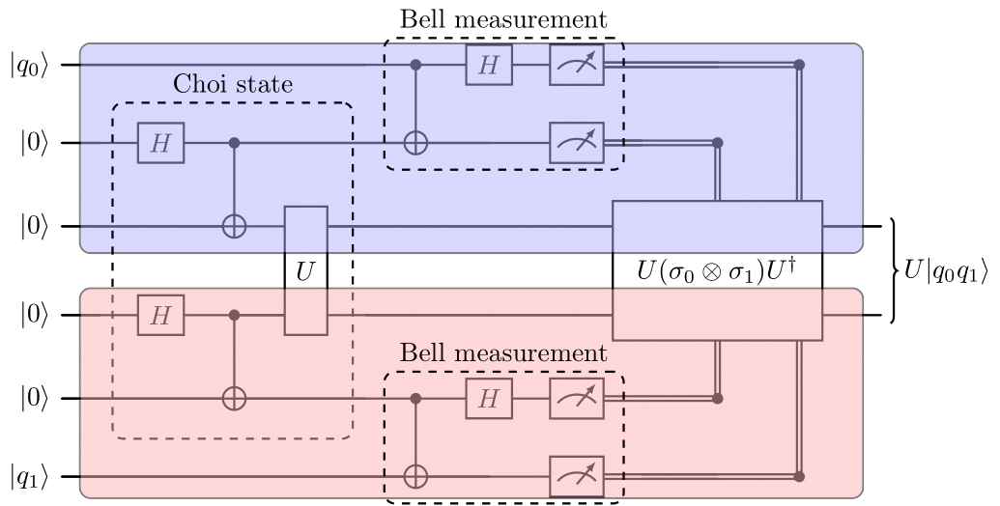
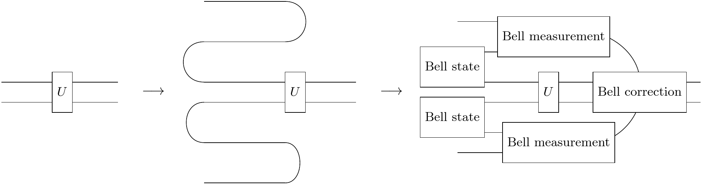
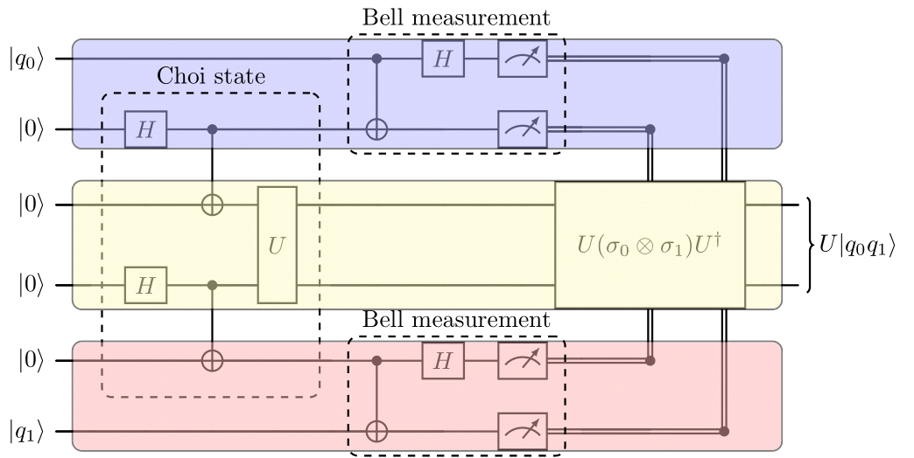
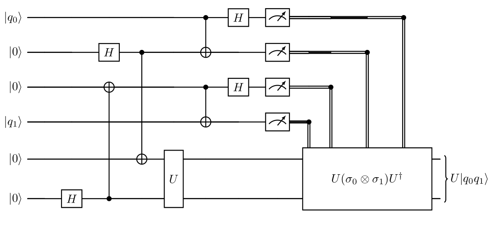

# SquidKnit: Circuit knitting with quantum and classical communication using SquidQASM

#### Valter Uotila, PhD student, University of Helsinki

Summary: Scaling up qubit number and their connectivity is a huge challange for quantum hardware developers. The recent research has proposed circuit knitting as a solution. In this work, I study the circuit knitting scheme for Clifford gates. In other words, circuit knitting means a teleportation scheme which teleports two states through a Clifford gate and automatically applies the needed correction operation. In the future circuit knitting could be performed accross distributed quantum computers connected in quantum internet.

## Introduction to problem

Originally my interest towards this topic was sparked by the [blog post](https://research.ibm.com/blog/100k-qubit-supercomputer) and [blog post](https://research.ibm.com/blog/circuit-knitting-with-classical-communication) by IBM. They aim to build a 100,000 qubits quantum-centric supercomputer. The main idea is to connect multiple smaller quantum computers together with classical links and later with quantum links.

The blog post referred to the paper [Circuit knitting with classical communication](http://arxiv.org/abs/2205.00016) which has worked as a starting point for this implementation. The paper contains the following figure which describes the circuit knitting scheme for Clifford gates.

We require that the gate U is Clifford since otherwise the correction operation is not local (does it even exist for non-Clifford gates?). One way to understand the construction is to rewrite the circuit using [string diagrams](https://doi.org/10.1017/9781316219317)

For example, for CNOT-gate the previous construstion becomes [this](https://algassert.com/quirk#circuit=%7B%22cols%22:[[%22%E2%80%A6%22,%22%E2%80%A6%22,%22%E2%80%A6%22,%22%E2%80%A6%22,%22%E2%80%A6%22,%22%E2%80%A6%22],[1,%22H%22,1,%22H%22],[1,%22%E2%80%A2%22,%22X%22],[1,1,1,%22%E2%80%A2%22,%22X%22],[1,1,%22X%22,%22%E2%80%A2%22],[%22%E2%80%A2%22,%22X%22],[%22H%22],[%22Measure%22,%22Measure%22],[1,1,1,1,%22%E2%80%A2%22,%22X%22],[1,1,1,1,%22H%22],[1,1,1,1,%22Measure%22,%22Measure%22],[%22%E2%80%A2%22,1,%22Z%22,%22Z%22],[1,1,%22X%22,%22X%22,1,%22%E2%80%A2%22],[1,1,1,%22Z%22,%22%E2%80%A2%22],[1,%22%E2%80%A2%22,%22X%22]]%7D) and for CZ-gate it becomes [this](https://algassert.com/quirk#circuit=%7B%22cols%22:[[%22X%22,1,1,1,1,%22X%22],[%22%E2%80%A6%22,%22%E2%80%A6%22,%22%E2%80%A6%22,%22%E2%80%A6%22,%22%E2%80%A6%22,%22%E2%80%A6%22],[1,%22H%22,1,%22H%22],[1,1,1,%22%E2%80%A2%22,%22X%22],[1,%22%E2%80%A2%22,%22X%22],[1,1,%22Z%22,%22%E2%80%A2%22],[%22%E2%80%A2%22,%22X%22],[%22H%22],[%22Measure%22,%22Measure%22],[1,1,1,1,%22%E2%80%A2%22,%22X%22],[1,1,1,1,%22H%22],[1,1,1,1,%22Measure%22,%22Measure%22],[1,1,%22Z%22,%22X%22,1,%22%E2%80%A2%22],[1,1,1,%22Z%22,%22%E2%80%A2%22],[1,%22%E2%80%A2%22,%22X%22,%22Z%22],[1,%22%E2%80%A2%22,%22Z%22]]%7D).

The similar idea is also presented [here](https://algassert.com/post/1717) and [here](https://en.wikipedia.org/wiki/Quantum_gate_teleportation).

## Implementation

First I aimed to implement the version which is presented in the paper [Circuit knitting with classical communication](http://arxiv.org/abs/2205.00016). However, I was not sure how to deal with SquidASM and prepare the Choi state using SquidASM. 

The same circuit has also a simple cut into three parts:

Now we see that interaction between the parts can be realized with two EPR pairs and classical communication. On the other hand, it become quite fast clear that SquidASM is not yet able to simulate networks which have three nodes and two links. You can find a initial draft in the folder application_three_nodes.

Thus, the second way to organize the circuit is the following:

In practice this method is just two state teleportations which teleport the state through the two qubit gate. The first four qubits are on the client side and provide input for the gate U. The last two qubits are on the server side. This scheme might be useful, for example, in the cases that the state is on a machine which does not implement the two-qubit gate.

### Correction operator

## Discussion

### Related work

Qiskit implements the [circuit knitting toolbox](). ZX-calculus based circuit knitting on [YouTube](https://www.youtube.com/watch?v=YPtEIuapWww) and [arXiv](https://arxiv.org/abs/2302.00387).